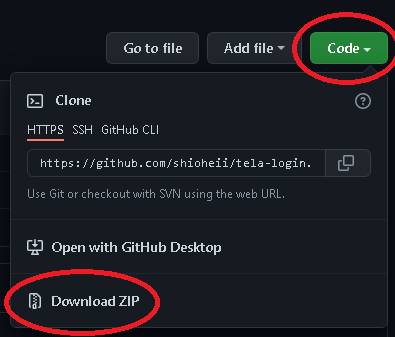

# Projeto Shioheify

<!--<a href="https://github.com/shioheii">
  
</a>
<a href="#">
  
</a>
<a href="#">
  
</a>
<a href="#">
  
</a>
<a href="#">
  
</a><br />-->

Eu desenvolvi este projeto para praticar conceitos de HTML e CSS, buscando aplicar os conceitos de semântica, box-model. Busquei trabalhar também com responsividade, que é um conteúdo que ainda preciso estudar.

## Sobre o projeto:

Minha idéia foi criar uma tela de login de usuário, com navegação para uma tela de cadastro, caso o usuário ainda não possua uma conta.

## O que aprendi e pratiquei?

- Semântica e box-model no HTML
- Estruturação de código no CSS
- Trabalhei responsividade (basicamente com as propriedades width e max-width)

## Linguagens utilizadas:

- HTML
- CSS

## Ferramenta utilizada:

- [Visual Studio Code](https://code.visualstudio.com/)

## Executar projeto na sua máquina:

Para executar este projeto no seu computador, basta clicar em "Code" e depois em "Download ZIP":


Ou clone o repositório pelo link:

```bash
$ git
```

Então abra a página "index.html" no navegador.

---

<p align="center">
  <a alt="Bruno Shiohei Kinoshita do Nascimento Linkedin" href="https://www.linkedin.com/in/bruno-shiohei/">
    
  </a>
  <a alt="Bruno Shiohei Kinoshita do Nascimento GitHub" href="https://github.com/shioheii">
    
  </a>
</p>
